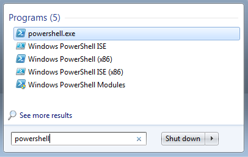
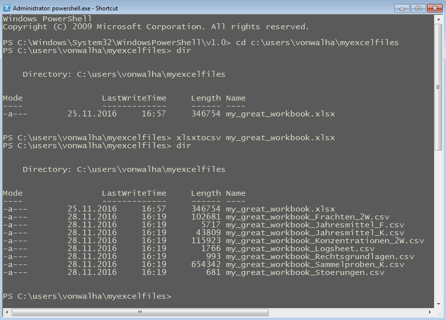

# xslxtocsv

This is a quick and dirty script to export one MS Office Excel
workbook in OOXML format (*.xlsx) to multiple CSV files, one per
Worksheet.  The names of output files are derived from the basename of
the input file and from the names of the Worksheets.  The script
writes [RFC4180](https://tools.ietf.org/html/rfc4180) conform
files. Empty cells are replaced with empty strings.

----------------------

## Usage:

    xlsxtocsv.py [-h] [-o OUTPUTDIRECTORY] EXCELFILE

    Exports multiple CSV files from an Excel *.xlsx Workbook

    positional arguments:
      EXCELFILE           The Excel file to export

    optional arguments:
      -h, --help          show this help message and exit
      -o OUTPUTDIRECTORY  The output directory, default is the current directory.

## Notes for Windows users

### Installation

+ Download the installer [xlsxtocsv_setup.exe](https://github.com/eawag-rdm/xlsxtocsv/raw/master/Output/xlsxtocsv_setup.exe)
+ Double-click it.
+ Click "Install". Note: No administrative rights are required on your Windows computer to install xlsxtocsv.
+ Click "Finish" and allow your computer to reboot.

### Usage

+ This program can be controlled by commands that are communicated by typing them on the keyboard.
+ To do that, open the "Powershell" application by typing "powershell"
  into the search-box at the bottom of the Start menu, and then click on
  the respective icon (see Figure 1).
 + Observe that a window appers in which you can type text (see Figure 2).
+ Use the `cd` command to change to the directory in which the file that you want to convert is located, e.g.  
    `cd c:\users\vonwalha\myexcelfiles` (see Figure 2).
+ Use the `dir` command to list the contents of the directory (see Figure 2).
+ Assumning the name of the file you want to convert is `my_great_workbook.xlsx`, type    
    `xlsxtocsv my_great_workbook.xlsx`
+ Allow a couple of seconds before the [*command prompt*](https://en.wikipedia.org/wiki/Command-line_interface#Command_prompt) appears again, indicating that the program is finished.
+ type `dir` to check that you now have CSV files in the directory, one for each Worksheet (see Figure 2).
+ type `xlsxtocsv -h` to get help for more options of the program.
+ in case you want learn more about communicating with your computer
  by means of typed "commands", [here
  is a very brief tutorial](http://www.cs.princeton.edu/courses/archive/spr05/cos126/cmd-prompt.html).

  
Figure 1: invoke powershell

Figure 2: type commands
